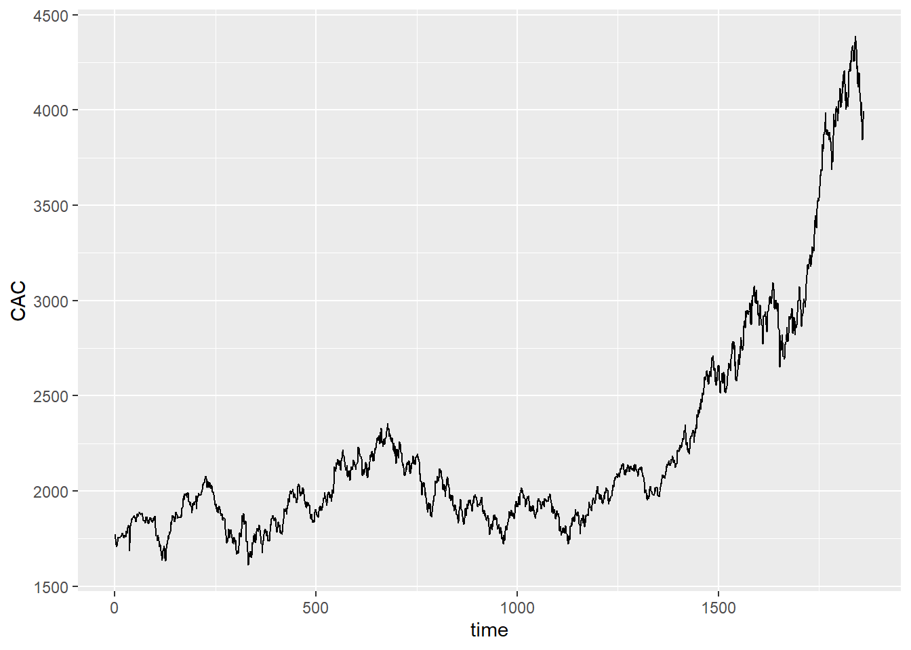
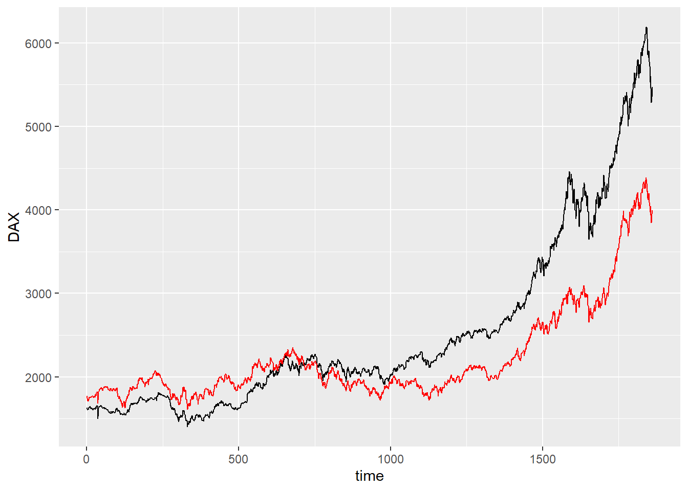
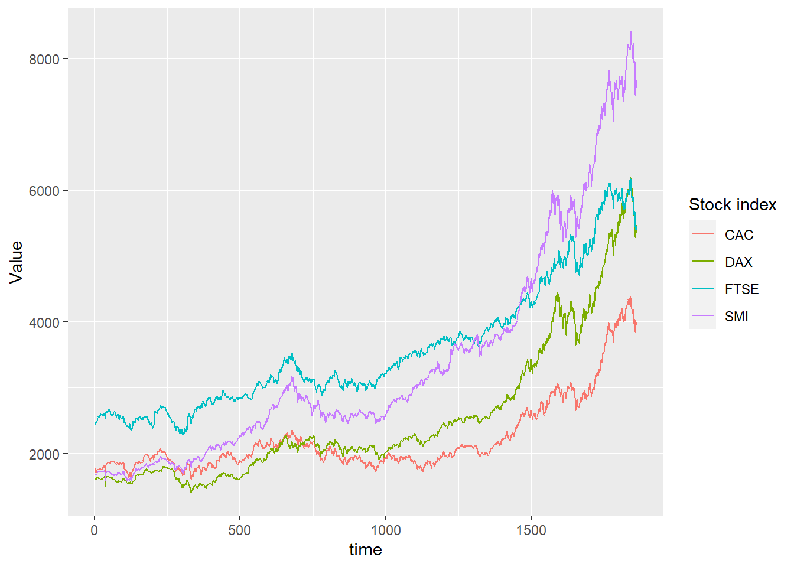
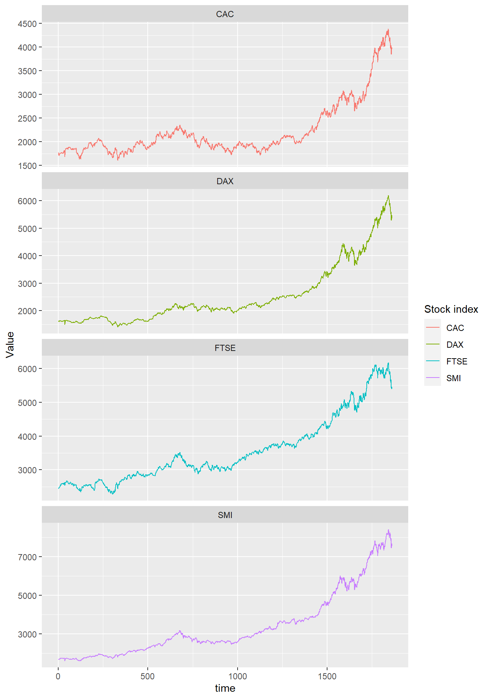

## Tidyr and ggplot2

::: {.cell}

```{.r .cell-code}
here::i_am("Git_R_1.Rproj")
library(here)
library(ggplot2)
library(dplyr)
library(tidyr)
```
:::


### Multiple lines on a single graph

::: {.cell}

```{.r .cell-code}
eustock <- as.data.frame(EuStockMarkets)
eustock <- eustock |> mutate(time = 1:n())
```
:::

::: {.cell}

```{.r .cell-code}
ggplot(eustock, aes(x = time, y = CAC)) +
  geom_line()
```

::: {.cell-output-display}
{width=672}
:::
:::


### Wrong Solution

::: {.cell}

```{.r .cell-code}
ggplot(eustock, aes(x = time, y = DAX)) +
  geom_line() +
  geom_line(aes(y = CAC), color = "red")
```

::: {.cell-output-display}
{width=672}
:::
:::


problems here: 
- y axis name is wrong
- colours must be specified manually
- we miss an association between colours and names

### Right answer (using the Tidyr you guessed it)

::: {.cell}

```{.r .cell-code}
long_eustock <-
  eustock |> pivot_longer(-time, names_to = "Stock index", values_to = "Value")
```
:::

::: {.cell}

```{.r .cell-code}
ggplot(long_eustock, aes(x = time, y = Value, group = `Stock index`, color = `Stock index`)) +
  geom_line()
```

::: {.cell-output-display}
{width=672}
:::
:::

You could get rid of groups here, but some other time it might be necessary.


::: {.cell}

```{.r .cell-code}
ggplot(long_eustock, aes(x = time, y = Value, group = `Stock index`, color = `Stock index`)) +
  geom_line() +
  facet_wrap(~`Stock index`, ncol = 1, scales = "free_y")
```

::: {.cell-output-display}
{width=672}
:::
:::
